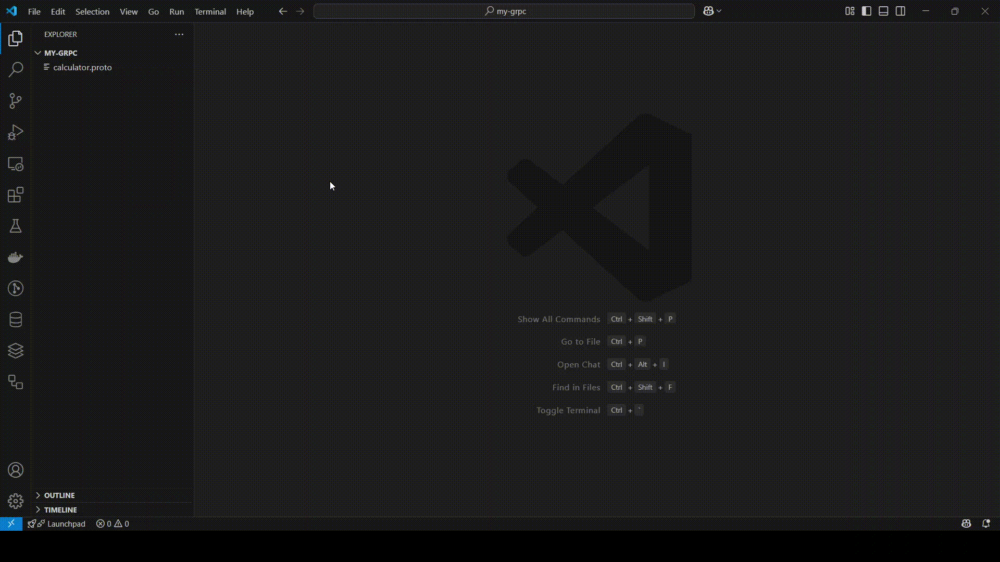

# gRPC Compiler


[](https://marketplace.visualstudio.com/items?itemName=devdogukan.grpc-compiler)

A Visual Studio Code extension for compiling Protocol Buffers (.proto) files to gRPC code in multiple programming languages.

## How to Work


## Features

This extension allows you to easily compile .proto files to generate gRPC client and server code directly from the VS Code explorer context menu.

Simply right-click on any .proto file and select "Compile Proto for gRPC" to generate code in your desired language.

Currently supported languages:
- [Go](#go)
- [Python](#python)
- [Java](#java)
- [Ruby](#ruby)
- [Dart](#dart)

## Requirements

For this extension to work properly, you need to have the following dependencies installed for each supported language:

### Protocol Buffers Compiler (protoc)

The Protocol Buffers compiler is required for all supported languages. Here's how to install it on different platforms:

#### Windows
- Download the pre-built binary from the [Protocol Buffers GitHub releases](https://github.com/protocolbuffers/protobuf/releases)
- Extract the zip file and add the `bin` directory to your PATH

#### macOS
- Install using Homebrew:
  ```
  brew install protobuf
  ```

#### Linux
- Install using your package manager, for example on Ubuntu:
  ```
  sudo apt-get install -y protobuf-compiler
  ```

### Go

#### Required Setup
- **Protocol Buffers compiler** (`protoc`)
  - Must be installed and available in your PATH
- **Go Plugin for Protocol Buffers** (`protoc-gen-go`)
  - Install using: 
    ```
    go install google.golang.org/protobuf/cmd/protoc-gen-go@latest
    ```
- **Go gRPC Plugin** (`protoc-gen-go-grpc`)
  - Install using:
    ```
    go install google.golang.org/grpc/cmd/protoc-gen-go-grpc@latest
    ```

#### Proto File Structure for Go
Your .proto file should include:

```protobuf
syntax = "proto3";

option go_package = "example.com/packagename";  // Define the Go package

package examplepackage;  // Define the proto package

// Service definition
service ExampleService {
  rpc ExampleMethod (ExampleRequest) returns (ExampleResponse);
}

// Message definitions
message ExampleRequest {
  string input = 1;
}

message ExampleResponse {
  string output = 1;
}
```

#### Generated Output
The compiler will generate:
- `*.pb.go` files containing message type definitions
- `*_grpc.pb.go` files containing the client and server code

---

### Python

#### Required Setup
- **Python 3.x**
- **gRPC tools**
  - Install using:
    ```
    pip install grpcio grpcio-tools
    ```

#### Proto File Structure for Python
Your .proto file should include:

```protobuf
syntax = "proto3";

package examplepackage;  // Define the proto package

// Service definition
service ExampleService {
  rpc ExampleMethod (ExampleRequest) returns (ExampleResponse);
}

// Message definitions
message ExampleRequest {
  string input = 1;
}

message ExampleResponse {
  string output = 1;
}
```

#### Generated Output
The compiler will generate:
- `*_pb2.py` files containing message type definitions
- `*_pb2_grpc.py` files containing the client and server code

---

### Java

#### Required Setup
- **Java Development Kit (JDK)**
  - Must be installed and available in your PATH
- **Protocol Buffers compiler** (`protoc`)
  - Must be installed and available in your PATH
- **Maven or Gradle project** with the following dependencies:
  - For Maven (in pom.xml):
    ```xml
    <dependency>
        <groupId>com.google.protobuf</groupId>
        <artifactId>protobuf-java</artifactId>
        <version>3.21.7</version>
    </dependency>
    <dependency>
        <groupId>io.grpc</groupId>
        <artifactId>grpc-protobuf</artifactId>
        <version>1.53.0</version>
    </dependency>
    <dependency>
        <groupId>io.grpc</groupId>
        <artifactId>grpc-stub</artifactId>
        <version>1.53.0</version>
    </dependency>
    ```
  - For Gradle (in build.gradle):
    ```groovy
    dependencies {
        implementation 'com.google.protobuf:protobuf-java:3.21.7'
        implementation 'io.grpc:grpc-protobuf:1.53.0'
        implementation 'io.grpc:grpc-stub:1.53.0'
    }
    ```

#### Proto File Structure for Java
Your .proto file should include:

```protobuf
syntax = "proto3";

option java_multiple_files = true;
option java_package = "com.example.grpc";
option java_outer_classname = "ExampleProto";

package examplepackage;  // Define the proto package

// Service definition
service ExampleService {
  rpc ExampleMethod (ExampleRequest) returns (ExampleResponse);
}

// Message definitions
message ExampleRequest {
  string input = 1;
}

message ExampleResponse {
  string output = 1;
}
```

#### Generated Output
The compiler will generate:
- Java classes for each message type
- gRPC service interfaces and stubs
- Files will be generated following the Java package structure

---

### Ruby

#### Required Setup
- **Ruby 2.5 or newer**
  - Must be installed and available in your PATH
- **Protocol Buffers compiler** (`protoc`)
  - Must be installed and available in your PATH
- **Ruby gRPC gems**
  - Install using:
    ```
    gem install grpc grpc-tools
    ```

#### Proto File Structure for Ruby
Your .proto file should include:

```protobuf
syntax = "proto3";

package examplepackage;  // Define the proto package

// Service definition
service ExampleService {
  rpc ExampleMethod (ExampleRequest) returns (ExampleResponse);
}

// Message definitions
message ExampleRequest {
  string input = 1;
}

message ExampleResponse {
  string output = 1;
}
```

#### Generated Output
The Ruby compiler generates the following files:
- A `lib` directory in the same location as your .proto file
- Ruby service files for gRPC client and server implementations
- Ruby message classes for Protocol Buffer message types

The generated files follow Ruby naming conventions, converting snake_case.proto files to snake_case Ruby files.

---

### Dart

#### Required Setup
- **Dart SDK**
  - Must be installed and available in your PATH
- **Protocol Buffers compiler** (`protoc`)
  - Must be installed and available in your PATH
- **Dart protoc plugin**
  - Install using:
    ```
    dart pub global activate protoc_plugin
    ```
  - Make sure `~/.pub-cache/bin` is in your PATH

#### Proto File Structure for Dart
Your .proto file should include:

```protobuf
syntax = "proto3";

package examplepackage;  // Define the proto package

// Service definition
service ExampleService {
  rpc ExampleMethod (ExampleRequest) returns (ExampleResponse);
}

// Message definitions
message ExampleRequest {
  string input = 1;
}

message ExampleResponse {
  string output = 1;
}
```

#### Generated Output
The Dart compiler generates the following files:
- A `lib/src/generated` directory structure in the same location as your .proto file
- Dart files for gRPC client and server implementations
- Dart classes for Protocol Buffer message types

The generated files follow Dart naming conventions, converting snake_case.proto files to snake_case.dart files.

---

The extension will check for these dependencies and offer to install them if they are missing.

## How To Use

1. Open a project containing .proto files
2. Right-click on any .proto file in the explorer
3. Select "Compile Proto for gRPC" from the context menu
4. Choose the target language (Go, Python, Java, Ruby, or Dart)
5. The compiler will generate the appropriate files in the same directory as the .proto file

## Extension Settings

This extension currently doesn't have any configurable settings.

## Known Issues

- The extension requires all dependencies to be properly installed and available in the system PATH
- Complex proto imports may require manual configuration
- For Java compilation, a Maven or Gradle project with the required dependencies must exist in the parent directories

## Release Notes

See the [CHANGELOG.md](CHANGELOG.md) for release notes details.

## Roadmap and Language Support Status

### Currently Supported Languages
- ✅ Go - Fully implemented
- ✅ Python - Fully implemented
- ✅ Java - Fully implemented
- ✅ Ruby - Fully implemented
- ✅ Dart - Fully implemented

### Planned Support
Languages we're planning to add support for:
- ⏳ C# / .NET - In development
- ⏳ C++ - Planned
- ⏳ Kotlin - Planned
- ⏳ Node.js - Planned
- ⏳ Objective-C - Planned
- ⏳ PHP - Planned

Want to contribute? Feel free to submit a pull request to help implement support for new languages!

---

**Enjoy!**
